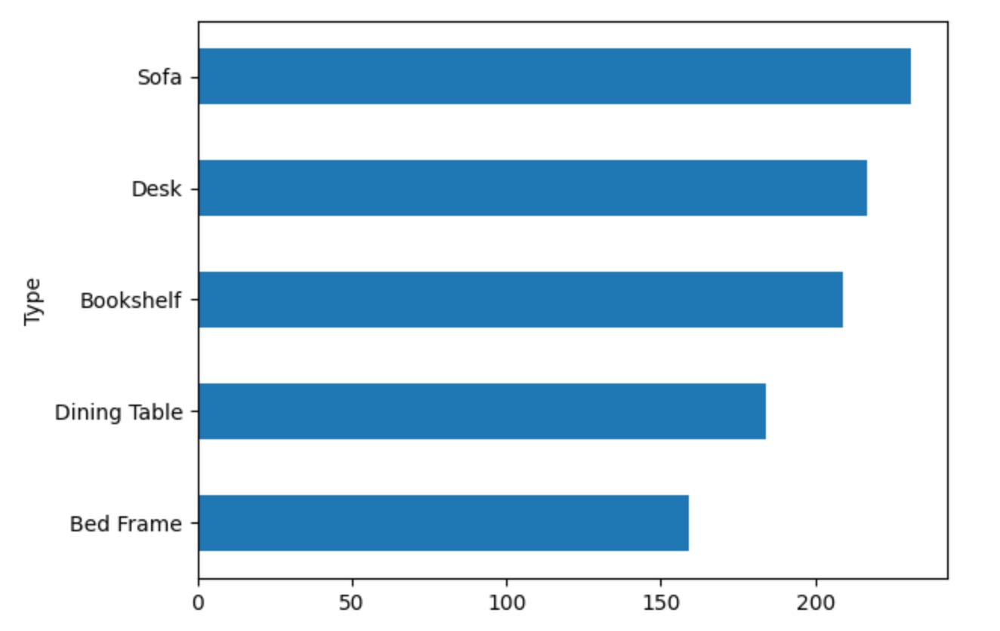

# Business Analyst

### Education
The University of Arizona, Eller College of Management

Major: Finance and Management Information Systems | May 2027
GPA: 4.0
Honors/Awards: Global Wildcat Scholarship Award, Highest Academic Distinction

### Work Experience
Student Finance Specialist @ University of Arizona, Finance Strategy & Solutions | April 2024 – Present
- Optimized reports and projections with university financial reporting databases enhancing data accuracy and timeliness for 15%.
- Streamlined audit, AP/AR processes, administration and reconciliation of accounts improving financial
controls and administrative efficiency for 23%.
- Established financial and accounting data analysis, identifying and investigating a $400,000 financial discrepancy
- Conducted research topics and procedures pertaining to compliance with GASB & ABOR guidelines.

Assistant to the CEO @ Boss Security Screens  | March 2024 – Present
- Consulted 5 business divisions in 3 states, implemented financial reporting and informational systems,
standardized procedures for expanded locations and reduced operations timeline by 30%.
- Conducted partner conferences to address pain points, increased satisfaction by 65%, and installed systems improving customer satisfaction by 35%.
- Researched and provided cost-effective solutions, achieving a 40% performance improvement and a 70% increase in marketing lead income.

National executive board member, Head of PR Department @ Youth Movement of Koreans in Kazakhstan Public Association | October 2022 – August 2023
- Coordinated international concerts, conventions, and conferences with an attendance of 3,000 people.
- Cultivated relationships with prominent industry leaders by hosting key entrepreneurial forums.
- Recruited, trained, and led a team of 100 employees for major national level events.

Development Strategy Intern @ Made in Korea (MIKO) | June 2022 – August 2023
- Developed promotional campaign involving collaboration with the nation's most prominent influencers.
- Managed and implemented major marketing events resulting in an increased conversion rate by 25%.
- Established local production and supply chain system by increasing 10% sales.

### Tableu Projects
[View my Tableau Dashboards](https://public.tableau.com/app/profile/andrei.sim/vizzes)

### Python Projects
#### Wayfair Sales & Product Trends Analysis


# --- Imports ---
import os
import io
import pandas as pd
import numpy as np
import matplotlib.pyplot as plt

from google.colab import files
from plotnine import (
    ggplot, aes, geom_col, geom_line, geom_smooth,
    facet_wrap, scale_y_continuous, scale_x_datetime,
    labs, theme, theme_minimal, expand_limits, element_text
)
from mizani.breaks import date_breaks
from mizani.formatters import date_format, currency_format

# --- Upload & Load Excel Files ---
uploaded = files.upload()

product_df = pd.read_excel("/content/wayfair_products.xlsx")
orderlines_df = pd.read_excel("/content/wayfair_orderlines.xlsx")
shops_df = pd.read_excel("/content/wayfair_shops.xlsx")

# --- Merge DataFrames ---
orderline_joined_df = (
    orderlines_df
    .merge(product_df, how="left", left_on="product.id", right_on="product.id")
    .merge(shops_df, how="left", left_on="store.id", right_on="shop.id")
)

orderline_joined_df.info()
print(orderline_joined_df)

# --- Data Wrangling ---
df = orderline_joined_df.copy()
temp_df = df['product.info'].str.split('-', expand=True)
df['Type'] = temp_df[0]
df['Style'] = temp_df[1]
df.drop(columns='shop.id', inplace=True)
df.columns = df.columns.str.replace(".", "_")
df['total_sales'] = df['price'] * df['quantity']
top_10_orders = df.sort_values('total_sales', ascending=False).head(10)
print(top_10_orders)

# --- Examining Data ---
product_df.head(5)
orderlines_df.head(5)

# --- Creating Top 5 Material ---
m = product_df['material']
material_frequency_series = m.value_counts()
material_frequency_series.nlargest(5)

top5_material = product_df['material'].value_counts().nlargest(5).sort_values(ascending=True)
fig1 = top5_material.plot(kind="barh", title="Top 5 Materials")
plt.show()

orderlines_wrangled_df = df.copy()

# --- Creating Top 5 Type ---
t = orderlines_wrangled_df['Type']
sn_frequency_series = t.value_counts()
sn_frequency_series.nlargest(5)

top5_type = orderlines_wrangled_df['Type'].value_counts().nlargest(5).sort_values(ascending=True)
fig2 = top5_type.plot(kind="barh", title="Top 5 Product Types")
plt.show()

# --- Creating Top 5 Style ---
s = orderlines_wrangled_df['Style']
sn_frequency_series = s.value_counts()
sn_frequency_series.nlargest(5)

top5_style = orderlines_wrangled_df['Style'].value_counts().nlargest(5).sort_values(ascending=True)
fig3 = top5_style.plot(kind="barh", title="Top 5 Product Styles")
plt.show()

# --- Save Cleaned Data ---
os.makedirs("orderlines_wrangled_df", exist_ok=True)
orderlines_wrangled_df.to_pickle("/content/orderlines_wrangled_df.pkl")

# --- Reload Pickled Data ---
df = pd.read_pickle("/content/orderlines_wrangled_df.pkl")
df = pd.DataFrame(df)
df.info()

# --- Weekly Sales Analysis ---
order_date_series = df['order_date']
order_date_series.dt.year

sales_week = (
    df[['order_date', 'total_sales']]
    .set_index('order_date')
    .resample('W')
    .agg(np.sum)
    .reset_index()
)

sales_week.set_index('order_date').plot(
    kind='line', subplots=True, layout=(1, 1), figsize=(10, 5)
)
plt.show()

# --- Quarterly Price Analysis ---
price_quarter_df = (
    df[['order_date', 'price']]
    .set_index('order_date')
    .resample('Q')
    .agg(np.mean)
    .reset_index()
)

price_quarter_df.set_index('order_date').plot(
    kind='line', subplots=True, layout=(1, 1), figsize=(10, 5)
)
plt.show()

# --- ggplot Visualization for Weekly Revenue ---
!pip install scikit-misc

usd = currency_format(prefix="$", precision=2, big_mark=',')

ggplot(data=sales_week, mapping=aes(x='order_date', y='total_sales')) + \
geom_line() + \
geom_smooth(method='loess', color='blue', span=0.3) + \
scale_y_continuous(labels=usd) + \
labs(title='Revenue by Week', x='Date', y='Revenue') + \
theme_minimal() + \
expand_limits(y=0)

# --- Sales by Style per Quarter ---
sales_by_quarter_Style = (
    df[['Style', 'order_date', 'total_sales']]
    .set_index('order_date')
    .groupby("Style")
    .resample('Q')
    .agg(np.sum)
    .drop(columns='Style')
    .reset_index()
)

df_pivot = sales_by_quarter_Style.pivot(
    index='order_date',
    columns='Style',
    values='total_sales'
).fillna(0)

df_pivot.plot(kind='line', subplots=True, layout=(5, 1), figsize=(15, 15))
plt.tight_layout()
plt.show()

df_pivot.plot(kind='line', figsize=(15, 7))
plt.title("Total Sales by Style per Quarter")
plt.ylabel("Total Sales")
plt.xlabel("Order Date")
plt.grid(True)
plt.legend(title='Style', bbox_to_anchor=(1.05, 1), loc='upper left')
plt.tight_layout()
plt.show()


### Results

Top Products Material, Type, Style by Quantity

Weekly Sales Plot
Based on the weekly sales plot, we can observe that volatility decreased and the mean sales level increased. The highest and lowest total sales occurred in November.

Quarterly sales plot
Based on the quarterly sales plot, we can see that average total sales increased by the last quarter. The year 2023 started with a drop in sales.

Weekly revenue graph
Based on the weekly revenue graph, revenue started to rise from May 1st onward. There was also high volatility in November. Black friday sales influenced rise of the furniture

Divided Total Sales by style per Quarter
Based on the graphs of sales by furniture style, the Black Friday trend is evident due to the simultaneous rise and fall in sales across styles. Scandinavian furniture had the highest total sales. Traditional and Mid style had the lowest compared to others.

Joined Total Sales by style per Quarter
In my opinion, this plot is easier to read and more practical for strategic business planning due to the grouping by sales. Based on this, the business could consider focusing more on Scandinavian-style furniture to increase revenue. Additionally, the graph helps identify which styles could be scaled down due to lower sales performance.

#### Ski Sales Analysis: Data Wrangling, Visualization, and Trend Forecasting

  <pre>
    <code>
# =====================================
# 1. Import Libraries
# =====================================
import os
import io
import numpy as np
import pandas as pd
import matplotlib.pyplot as plt

from plotnine import (
    ggplot, aes, geom_col, geom_line, geom_smooth, facet_wrap,
    scale_y_continuous, scale_x_datetime, labs, theme_minimal,
    expand_limits
)
from mizani.breaks import date_breaks
from mizani.formatters import date_format, currency_format

# =====================================
# 2. Upload & Load Data
# =====================================
from google.colab import files
uploaded = files.upload()

skis_df = pd.read_excel("/content/skis.xlsx")
orderlines_df = pd.read_excel("/content/orderlines_skis.xlsx")
skishop_df = pd.read_excel("/content/skishops.xlsx")

# =====================================
# 3. Quick Look at Data
# =====================================
print(skis_df.head())
print(orderlines_df.head())
print(skishop_df.head())

# =====================================
# 4. Top Ski Models by Description
# =====================================
top3_ski_series = skis_df['description'].value_counts().nlargest(3)
top3_ski_series.plot(kind="barh", title="Top 3 Ski Descriptions")
plt.show()

# =====================================
# 5. Join DataFrames
# =====================================
ski_orderlines_joined_df = (
    orderlines_df.drop(columns='Unnamed: 0', errors='ignore')
    .merge(skis_df, how="left", left_on="product.id", right_on="ski.id")
    .merge(skishop_df, how="left", left_on="customer.id", right_on="skishop.id")
)
ski_orderlines_joined_df.info()

# =====================================
# 6. Data Wrangling
# =====================================
df = ski_orderlines_joined_df.copy()

# Split 'description' into 'Type' and 'Level'
df[['Type', 'Level']] = df['description'].str.split('-', expand=True)

# Extract 'City' and 'State' from 'location'
location_split = df['location'].str.split(',', expand=True)
df['City'] = location_split[0]
df['State'] = location_split[1]  # Previously duplicated

# Calculate total revenue
df['total_revenue'] = df['price'] * df['quantity']

# Keep relevant columns
cols_to_keep = [
    'order.id', 'order.line', 'order.date', 'ski.id', 'model', 'description',
    'price', 'skishop.name', 'location', 'Type', 'Level', 'City', 'total_revenue'
]
df = df[cols_to_keep].copy()

# Rename columns (replace '.' with '_')
df.columns = df.columns.str.replace(".", "_", regex=False)
df.info()

# Save wrangled data
os.makedirs("data_wrangled", exist_ok=True)
df.to_pickle("data_wrangled/ski_orderlines_wrangled_df.pkl")

# =====================================
# 7. Time Series Analysis
# =====================================
df = pd.read_pickle("data_wrangled/ski_orderlines_wrangled_df.pkl")

# Monthly revenue
sales_month_df = (
    df[['order_date', 'total_revenue']]
    .set_index('order_date')
    .resample('MS')
    .sum()
    .reset_index()
)

# Quick plot
sales_month_df.plot(x='order_date', y='total_revenue', title="Monthly Revenue")
plt.show()

# =====================================
# 8. Plot Revenue Trend (LOWESS)
# =====================================
usd = currency_format(prefix="$", precision=0, big_mark=",")

(
    ggplot(sales_month_df, aes(x='order_date', y='total_revenue')) +
    geom_line() +
    geom_smooth(method='lowess', color='blue', span=0.3) +
    scale_y_continuous(labels=usd) +
    labs(title='Revenue by Month', x='', y='Revenue') +
    theme_minimal() +
    expand_limits(y=0)
)

# =====================================
# 9. Weekly Sales by Skill Level
# =====================================
sales_by_level_week = (
    df[['Level', 'order_date', 'total_revenue']]
    .set_index('order_date')
    .groupby('Level')
    .resample('W')
    .sum()
    .drop(columns='Level')
    .reset_index()
)

# Pivot and plot
pivot_df = (
    sales_by_level_week
    .pivot(index='order_date', columns='Level', values='total_revenue')
    .fillna(0)
)

pivot_df.plot(kind='line', subplots=True, layout=(3, 1), figsize=(10, 8), title="Weekly Sales by Level")
plt.tight_layout()
plt.show()

    </code>
  </pre>

### Results

Top 5 Bikes based on description

Revenue by Month

Sales by Category and Week

